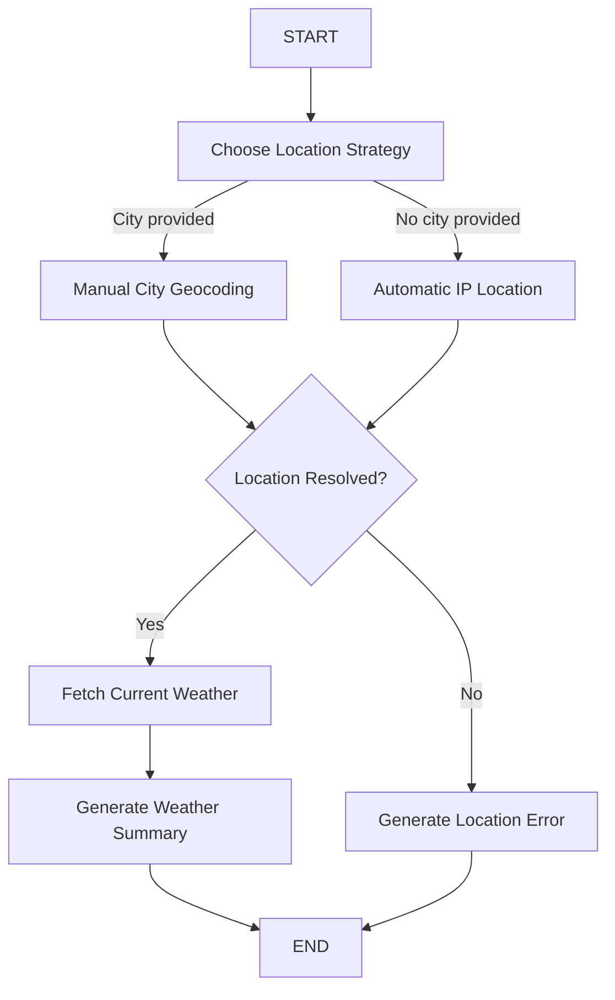

# 🌤️ Resilient LangGraph Weather Agent

A robust weather assistant built with **Python, LangGraph, Pydantic, and Open-Meteo APIs**.

This project was developed as part of an internship final assignment and demonstrates the progressive improvement of an incomplete weather-agent prototype into a reliable, testable, and resilient application.

The system can automatically detect the user's approximate location using their public IP address or allow the user to manually enter a city. It then retrieves current weather information, validates API responses, applies rule-based weather interpretation, and generates a user-friendly weather summary and recommendation.

---

## 🚀 Project Overview

The original version of the project contained several incomplete components, broken workflow connections, configuration issues, and missing validation.

The application was progressively improved to include:

- Correct LangGraph workflow execution
- Manual and automatic location selection
- City geocoding
- Weather API integration
- Conditional LangGraph routing
- Rate-limit handling
- Pydantic response validation
- Temperature classification
- Wind direction interpretation
- Human-readable recommendations
- Automated unit testing
- Graceful fallback behaviour

The project currently represents **Stage 2** of development.

---

## ✨ Current Features

### 📍 Automatic Location Detection

The application can determine the user's approximate location using their public IP address.

Example:

```text
Location: Leicester, England, United Kingdom
Location source: automatic IP detection
```

### 🌍 Manual City Search

Users can enter a city manually instead of relying on IP-based location detection.

Example:

```text
Enter city: Hyderabad
```

The application uses the Open-Meteo Geocoding API to retrieve:

- City
- Region
- Country
- Latitude
- Longitude
- Timezone

### 🔀 Conditional LangGraph Routing

The project uses LangGraph to dynamically select the appropriate location strategy.



This improves the architecture beyond a simple sequential workflow and demonstrates conditional state-based routing.

---

## 🛡️ Resilient Error Handling

External APIs can occasionally fail or impose request limits.

One issue discovered during testing was:

```text
HTTP 429 - Too Many Requests
```

Instead of repeatedly retrying the same request or crashing, the application now provides a manual city fallback.

Example:

```text
Automatic location detection is temporarily unavailable.

Reason:
Automatic IP location is temporarily rate-limited (HTTP 429).

Enter your city manually:
```

This makes the application more reliable when third-party services are unavailable.

---

## 🌦️ Weather Information

The application currently provides:

- Current weather condition
- Temperature
- Temperature category
- Wind speed
- Wind direction
- Local timezone
- Local time
- Personalised weather recommendation

Example output:

```text
============================================================
WEATHER AGENT
============================================================

Good evening, Santosh!

Location: Hyderabad, Telangana, India
Location source: manual city search
Time: 22:45 local (Asia/Kolkata, UTC+05:30)

Current conditions

• Weather: Mainly clear
• Temperature: 28.9°C (warm)
• Wind: 2.0 km/h from S (175°)

Recommendation: Stay hydrated if you will be outside.
```

---

## 🧠 Weather Interpretation

### Temperature Classification

Temperatures are categorised into:

| Temperature | Category |
|---|---|
| Below 10°C | Cold |
| 10°C – 17.9°C | Cool |
| 18°C – 25.9°C | Comfortable |
| 26°C – 31.9°C | Warm |
| 32°C and above | Hot |

These thresholds are configurable in the application settings.

### Wind Direction

Wind direction in degrees is converted into compass directions.

Examples:

```text
0°   → N
90°  → E
180° → S
270° → W
```

---

## 🏗️ Project Architecture

```text
weather_agent_final/
│
├── components/
│   ├── __init__.py
│   ├── config.py
│   ├── helper_functions.py
│   ├── nodes.py
│   ├── schema.py
│   └── state.py
│
├── tests/
│   ├── test_helper_functions.py
│   └── test_nodes.py
│
├── .env.example
├── .gitignore
├── graph.py
├── main.py
├── requirements.txt
└── README.md
```

---

## 🧩 Component Responsibilities

### `main.py`

Provides the command-line interface and manages automatic-location fallback behaviour.

### `graph.py`

Defines and compiles the LangGraph workflow.

### `components/nodes.py`

Contains the main workflow operations:

- Location strategy selection
- IP-based geolocation
- Manual city geocoding
- Weather retrieval
- Error handling
- Weather summary generation

### `components/state.py`

Defines the shared state passed between LangGraph nodes.

### `components/schema.py`

Contains Pydantic models used to validate external API responses.

### `components/helper_functions.py`

Contains reusable utilities such as:

- Temperature classification
- Weather-code conversion
- Wind direction conversion
- Time formatting
- Weather recommendations

### `components/config.py`

Stores application configuration including:

- API endpoints
- Request timeout values
- Retry limits
- Temperature thresholds
- Weather-code mappings

---

## 🔌 APIs Used

### ipapi.co

Used for approximate automatic location detection based on the user's public IP address.

### Open-Meteo Geocoding API

Used to convert a city name into geographical coordinates and timezone information.

### Open-Meteo Forecast API

Used to retrieve current weather data using latitude and longitude.

No API key is required for the public endpoints used by this application.

---

## ⚙️ Installation

Python **3.13** is recommended for this project.

### 1. Clone the repository

```bash
git clone https://github.com/YOUR_USERNAME/weather-agent-internship-project.git
cd weather-agent-internship-project
```

### 2. Create a virtual environment

Windows PowerShell:

```powershell
py -3.13 -m venv .venv
Set-ExecutionPolicy -Scope Process -ExecutionPolicy Bypass
.\.venv\Scripts\Activate.ps1
```

### 3. Install dependencies

```powershell
python -m pip install --upgrade pip
python -m pip install -r requirements.txt
```

---

## ▶️ Running the Application

Run:

```powershell
python main.py
```

The program will ask for your name:

```text
Enter your name:
```

You can then either enter a city:

```text
Enter city: Hyderabad
```

or press Enter to attempt automatic location detection:

```text
Enter city (leave blank for automatic location detection):
```

---

## 🧪 Automated Testing

Run:

```powershell
python -m unittest discover -s tests -v
```

Current result:

```text
Ran 12 tests in 0.002s

OK
```

The test suite currently covers:

- Temperature classification
- Weather-code lookup
- UTC offset handling
- Weather time formatting
- Wind-direction conversion
- Weather summary generation
- Manual city geocoding
- IP geolocation rate-limit handling
- Location error handling
- LangGraph location strategy routing
- Post-location routing

---

## 📈 Development Progress

### Stage 1 — Core Stabilisation

The initial incomplete prototype was reviewed and repaired.

Key improvements included:

- Fixed missing LangGraph workflow connections
- Corrected graph compilation
- Corrected the application entry point
- Repaired weather API configuration
- Fixed temperature-classification logic
- Corrected location-data handling
- Added weather response validation
- Added HTTP retry handling
- Added utility functions
- Added automated tests

**Result:**

```text
5 automated tests passing
```

### Stage 2 — Resilient Location Handling

The application was expanded with flexible and fault-tolerant location management.

Key improvements included:

- Manual city search
- Open-Meteo geocoding
- Conditional LangGraph routing
- IP-based location fallback
- HTTP 429 rate-limit handling
- Timezone-aware output
- Location-source reporting
- Expanded automated test coverage

**Result:**

```text
12 automated tests passing
```

---

## 📊 Current Workflow

```text
User Input
    ↓
Location Strategy
    ↓
 ┌─────────────────────┐
 │                     │
Automatic IP       Manual City
Location           Geocoding
 │                     │
 └─────────┬───────────┘
           ↓
    Location Validation
           ↓
       Weather API
           ↓
   Weather Interpretation
           ↓
       Recommendation
           ↓
        Final Output
```

---

## 💡 Engineering Challenges Addressed

### Dependency Compatibility

The initial environment used Python 3.14, which caused compatibility issues with the pinned `pydantic-core` dependency.

The project was migrated to Python 3.13 and isolated using a virtual environment.

### API Rate Limiting

Repeated requests to the automatic location provider resulted in HTTP 429 responses.

Instead of allowing the application to fail, a manual location fallback was introduced.

### Workflow Reliability

The original graph did not correctly connect all required processing stages.

The LangGraph workflow was redesigned and compiled with explicit routing and state transitions.

### Data Validation

External API responses are validated using Pydantic models before they are used within the workflow.

---

## 🛠️ Technologies

- Python 3.13
- LangGraph
- LangChain
- Pydantic
- Pydantic Settings
- Requests
- Open-Meteo API
- ipapi.co
- Python `unittest`
- Git
- GitHub

---

## 🔮 Planned Improvements

Future development stages may include:

- 5-day weather forecast
- Daily minimum and maximum temperature
- Rain probability
- Sunrise and sunset information
- Forecast-specific LangGraph routing
- More advanced weather recommendations
- Streamlit user interface
- Weather cards and visualisations
- Additional automated tests
- Logging and observability
- API response caching
- User preference support

---

## 🎯 Learning Outcomes

This internship project demonstrates practical experience with:

- Agent workflow design
- LangGraph state management
- Conditional routing
- REST API integration
- API response validation
- Error handling
- Rate-limit management
- Modular Python architecture
- Unit testing
- Dependency management
- Virtual environments
- Git-based development
- Progressive software improvement

---

## 📌 Project Status

**Current Development Stage:** Stage 2

**Automated Tests:** `12/12 passing`

**Current Capabilities:**

```text
✓ Automatic IP location
✓ Manual city search
✓ Conditional LangGraph routing
✓ Current weather retrieval
✓ Timezone-aware output
✓ Weather interpretation
✓ Weather recommendation
✓ API fallback handling
✓ Automated testing
```

---
## Results 


## 👨‍💻 Author

**Santosh Kumar**

Internship Final Assignment

Developed as a progressive software-engineering project demonstrating agent workflow design, API integration, validation, testing, and resilient application development.

---

## 📄 License

This project was developed for educational and internship assessment purposes.
